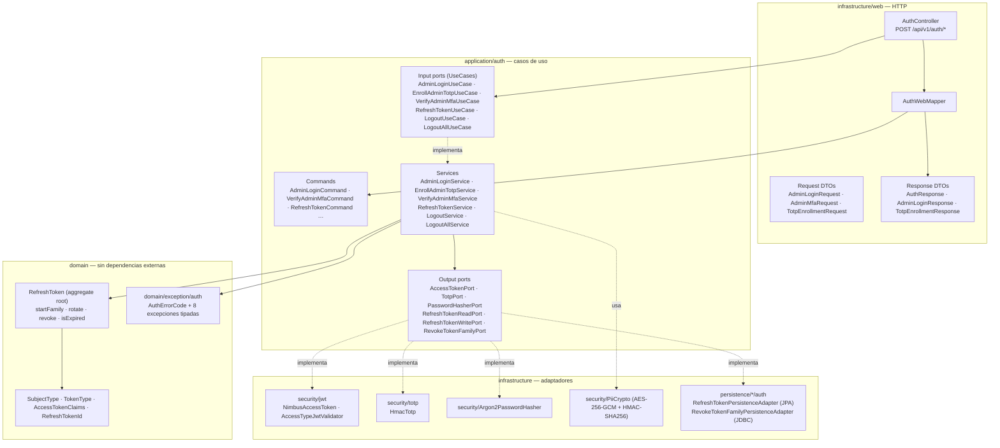
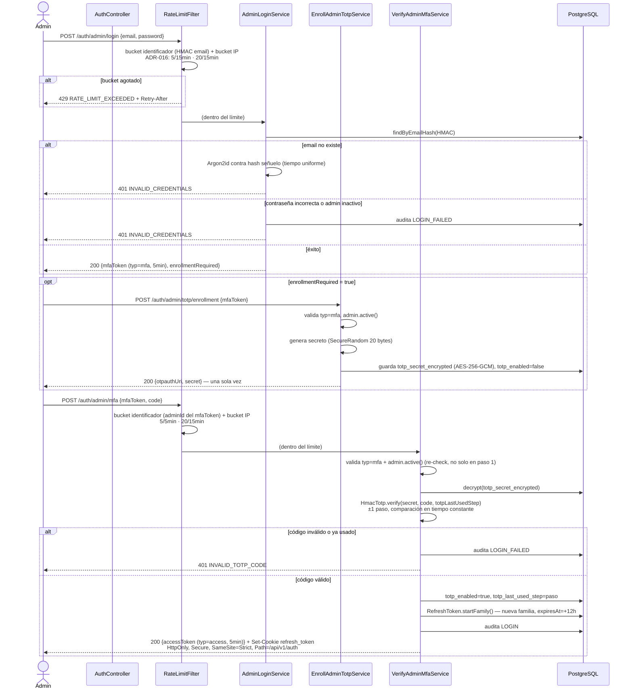
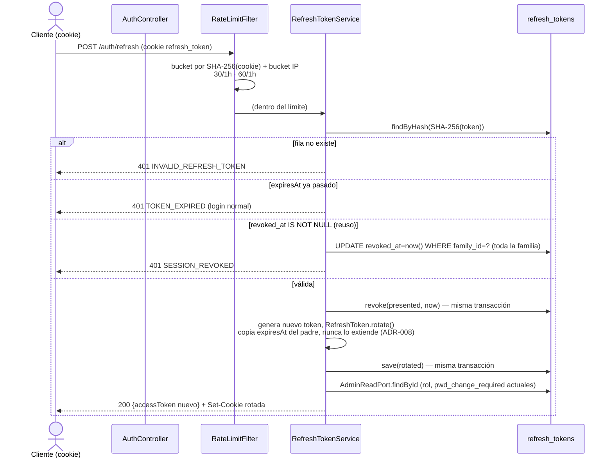
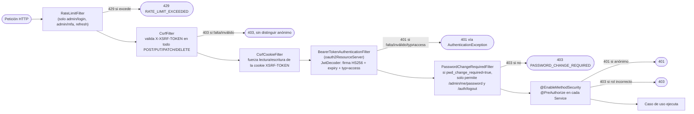
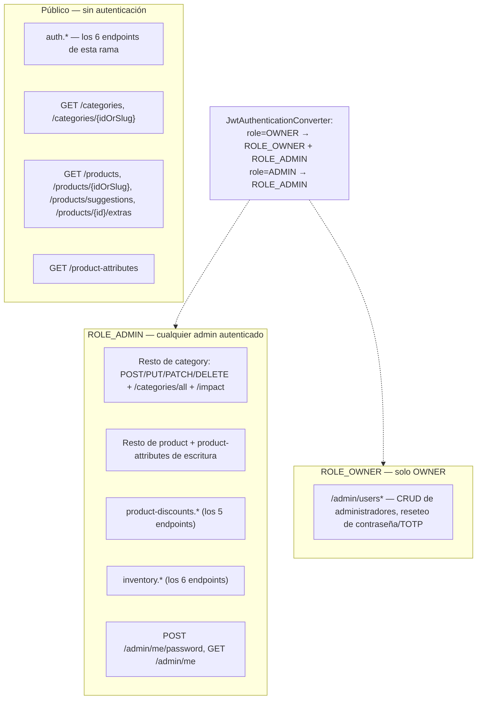
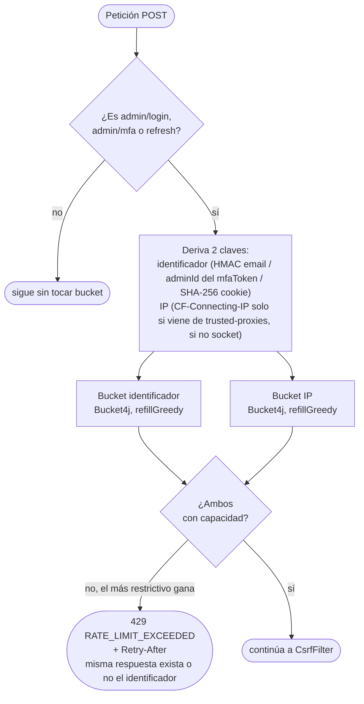
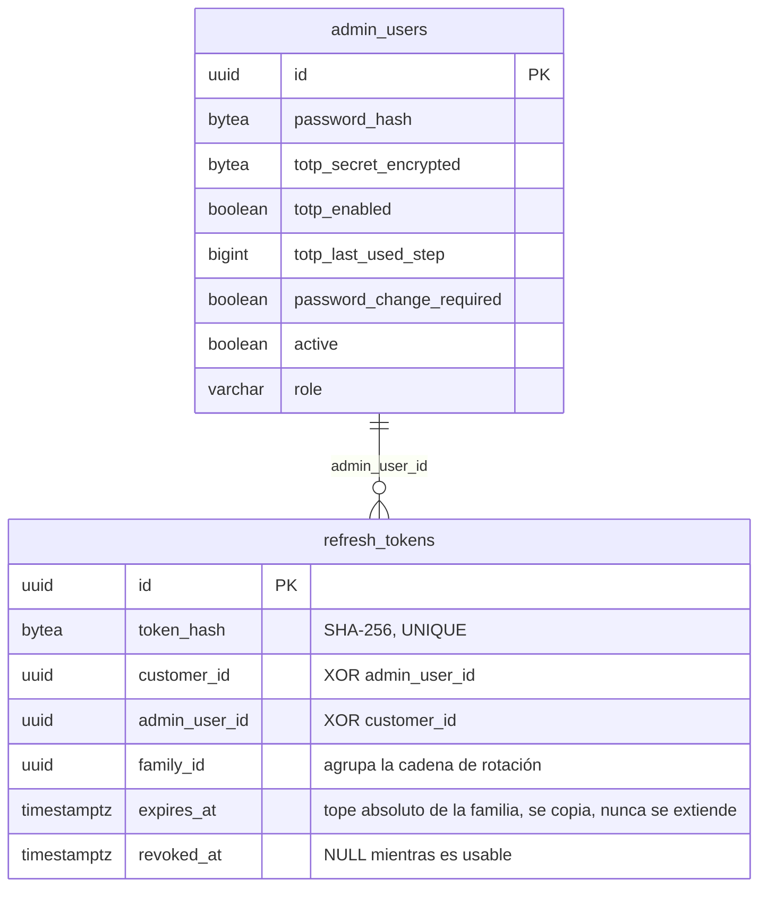
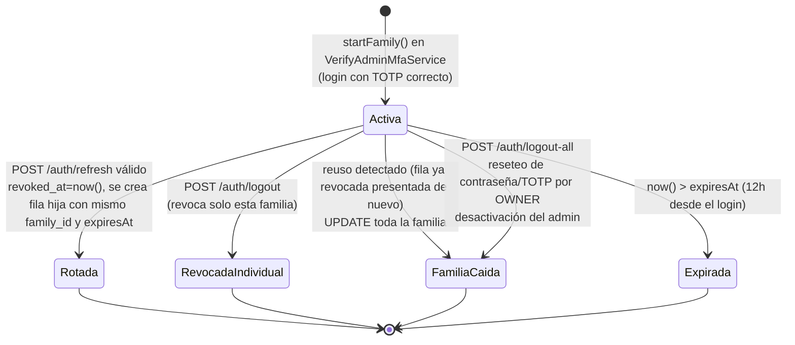

# `feature/auth` — Guía técnica completa

**Rama:** `feature/auth` · **Alcance:** autenticación de administrador (login en dos pasos + TOTP, rotación de refresh token, `@PreAuthorize` en toda la API, rate limiting) · **Estado:** REVIEWER y security-reviewer pasados, lista para PR contra `main`.

Este documento explica qué se implementó, con qué herramientas, qué mecanismos de seguridad entran en juego y cómo se relacionan los ficheros entre sí, para poder entender el módulo de principio a fin sin tener que reconstruir el hilo desde el código.

---

## 1. Qué resuelve esta rama

Antes de esta rama, `SecurityConfig` era un placeholder `permitAll()`: **toda** la API estaba abierta, y `AdminController` (ya codificado en `feature/admin`) resolvía el actor de auditoría desde `Authentication#getName()` — sin un filtro JWT real, esa resolución fallaba siempre. El módulo admin existía pero no era utilizable.

`feature/auth` cierra ese hueco:

- Login de administrador en dos pasos (contraseña → `mfaToken` efímero → TOTP → sesión real).
- Enrolamiento TOTP (RFC 6238) en el primer acceso.
- Emisión y verificación de JWT de acceso (HS256).
- Rotación de un único uso del refresh token, con detección de reuso y caída de familia completa (ADR-008).
- Logout / logout-all.
- `@PreAuthorize` cableado en los cinco módulos que antes estaban abiertos: `category`, `product`, `product-discounts`, `inventory`, `admin`.
- Rate limiting (ADR-016) en los tres endpoints que se pueden atacar por fuerza bruta.
- Gate de "contraseña provisional" (auth.md regla 3.9).

**Explícitamente fuera de alcance:** login de cliente (`LoginCustomerUseCase`) — no hay registro de cliente ni `MergeCartUseCase` todavía, así que sería código muerto. Se implementará en `feature/customer`.

---

## 2. Herramientas y dependencias

Todo lo nuevo que trae esta rama al `pom.xml`, y por qué se eligió en vez de otra opción:

| Dependencia | Para qué | Por qué esta y no otra |
|---|---|---|
| `spring-boot-starter-oauth2-resource-server` | `JwtEncoder`/`JwtDecoder` (Nimbus por debajo) + filtro `BearerTokenAuthenticationFilter` ya hecho | Evita escribir un filtro de parseo de JWT a mano; el proyecto ya usaba `spring-boot-starter-security` |
| `com.bucket4j:bucket4j_jdk17-core` | Buckets de rate limiting en memoria (ADR-016) | Sin infraestructura nueva (nada de Redis) — mismo criterio que ADR-008 rechazó para el blocklist de reuso |
| `javax.crypto.Mac` (JDK, sin dependencia) | TOTP (RFC 6238 sobre HOTP/RFC 4226), HMAC-SHA1 | ~150 líneas de JDK puro; ninguna librería TOTP nueva |
| `org.bouncycastle:bcprov-jdk18on` | *(ya existía)* Argon2id para `password_hash` | Reutilizado de `feature/admin`, no añadido en esta rama |
| `org.owasp.encoder:encoder` | *(ya existía)* `Encode.forJava(...)` inline en cada log con texto controlado por la petición | CodeQL `java/log-injection` — solo reconoce el wrapper llamado directamente en el propio log, nunca a través de un helper |

Todo lo demás (JPA, JDBC/`JdbcTemplate`, Flyway, ArchUnit, Checkstyle, SpotBugs) es infraestructura ya existente del proyecto, reutilizada sin cambios.

---

## 3. Arquitectura hexagonal del módulo

Mismo patrón que el resto del proyecto (Use-Case-First, ADR-001; puertos por capacidad, ADR-003): el dominio no conoce Spring, JPA ni HTTP.



**Lectura:** el controlador solo traduce HTTP ↔ Command/DTO (`AuthWebMapper` es la única clase que toca un tipo de dominio desde la capa web). Los servicios orquestan; el dominio (`RefreshToken`) contiene el único invariante real del módulo — que la rotación copia `expiresAt` sin extenderlo (ADR-008). Los adaptadores de infraestructura son intercambiables por diseño: nada en `application/auth` sabe que detrás hay Nimbus, BouncyCastle o `javax.crypto`.

---

## 4. Los seis casos de uso, ficheros involucrados

| Caso de uso | Endpoint | Servicio | Ficheros que toca |
|---|---|---|---|
| **Login admin, paso 1** | `POST /auth/admin/login` | `AdminLoginService` | `AdminReadPort` (lee), `PiiCryptoPort#hmac`, `PasswordHasherPort#matches`, `AccessTokenPort#issue` (`typ=mfa`), `AuditLogPort` (`LOGIN_FAILED`) |
| **Enrolamiento TOTP** | `POST /auth/admin/totp/enrollment` | `EnrollAdminTotpService` | `AccessTokenPort#parse` (valida `mfaToken`), `TotpPort#generateSecret`, `PiiCryptoPort#encrypt`, `AdminWritePort#save` |
| **Login admin, paso 2** | `POST /auth/admin/mfa` | `VerifyAdminMfaService` | `AccessTokenPort#parse`, `AdminReadPort`, `PiiCryptoPort#decrypt`, `TotpPort#verify`, `AdminWritePort#save`, `RefreshTokenWritePort#save` (`startFamily`), `AccessTokenPort#issue` (`typ=access`), `AuditLogPort` |
| **Renovación** | `POST /auth/refresh` | `RefreshTokenService` | `RefreshTokenReadPort#findByHash`, `RefreshTokenWritePort#revoke`+`save`, `RevokeTokenFamilyPort#revokeFamily` (solo en reuso), `AdminReadPort`, `AccessTokenPort#issue` |
| **Logout** | `POST /auth/logout` | `LogoutService` | `RefreshTokenReadPort`, `RevokeTokenFamilyPort#revokeFamily` |
| **Logout global** | `POST /auth/logout-all` | `LogoutAllService` | `RefreshTokenReadPort`, `RevokeTokenFamilyPort#revokeAllForSubject` |

---

## 5. Flujo completo: login de administrador



**El punto que rompía la seguridad si se omitía:** `VerifyAdminMfaService.resolveAdmin` vuelve a comprobar `admin.active()` en el paso 2, no solo en el paso 1. Sin ese re-check, un admin desactivado mientras su `mfaToken` seguía vivo (ventana de 5 min) podía completar el login y arrancar una sesión de hasta 12h — hallazgo real del security-reviewer, corregido en `f991bf4`.

---

## 6. Flujo completo: renovación y detección de reuso



`presented.revoke()` + `refreshTokenWritePort.save(rotated)` viven en la misma `@Transactional`: dos peticiones simultáneas con la misma cookie no pueden dejar dos tokens vivos de la misma familia.

---

## 7. La cadena de filtros de seguridad

Orden real en `SecurityConfig.securityFilterChain`, de fuera hacia dentro:



**Por qué `authorizeHttpRequests` es `permitAll()` en todas partes:** la autorización real vive en `@PreAuthorize` sobre cada `Service`, no en el filtro. Esto es deliberado (ADR-001/ADR-003 — el conocimiento de rol pertenece al caso de uso, no a la configuración HTTP), y significa que **todo** el control de acceso pasa por method security, un solo mecanismo para los seis módulos.

**El detalle que casi rompe esto:** un `@ExceptionHandler(AccessDeniedException.class)` intercepta la excepción *antes* de que `ExceptionTranslationFilter` pueda distinguir "anónimo" de "autenticado sin rol" — ambos casos llegan como el mismo tipo de excepción desde Spring Security 6.3+. `GlobalExceptionHandler.handleAccessDenied` repite esa comprobación a mano con `AuthenticationTrustResolverImpl`, con una excepción: un `CsrfException` siempre es 403, tenga o no sesión, porque CSRF es ortogonal a quién llama.

---

## 8. `@PreAuthorize`: qué protege cada módulo



**El conflicto que apareció al aplicar esto y cómo se resolvió:** dos casos (`GET /categories` vs `/categories/all`, y `GET /admin/{id}` vs `/admin/me`) compartían el *mismo* método de servicio para una ruta pública y una de administración — poner `@PreAuthorize` ahí habría bloqueado también la ruta pública. En vez de romper la regla "`@PreAuthorize` va en el servicio, nunca en el controlador", cada caso se dividió en dos casos de uso reales: `GetCategoriesUseCase` (público) / `GetAllCategoriesUseCase` (`ADMIN`), y `GetAdminUseCase` (`OWNER`) / `GetOwnAdminUseCase` (`ADMIN`, self). Documentado en ADR-004.

---

## 9. Rate limiting (ADR-016)



| Endpoint | Identificador | IP |
|---|---|---|
| `/auth/admin/login` | 5 / 15 min (HMAC email) | 20 / 15 min |
| `/auth/admin/mfa` | 5 / 5 min (adminId del `mfaToken`) | 20 / 15 min |
| `/auth/refresh` | 30 / 1 h (SHA-256 de la cookie) | 60 / 1 h |

Buckets en memoria (`ConcurrentHashMap`), expulsión de claves inactivas cada 30 min (techo documentado: con N instancias el límite efectivo es N×; upgrade a Bucket4j-Redis es un solo bean cuando haga falta). El body de la petición se envuelve en `CachedBodyRequestWrapper` porque el filtro necesita leer el email/`mfaToken` del JSON *antes* de que el resto de la cadena lo consuma.

---

## 10. Modelo de datos y ciclo de vida de `refresh_tokens`





No hay ninguna fila que se "extienda": cada rotación crea una fila nueva con el `family_id` y el `expiresAt` heredados del padre. Ese invariante vive solo en `RefreshToken.rotate()` (dominio) — ningún `CHECK` de PostgreSQL puede comparar una fila contra sus hermanas, así que el único punto de escritura de rotación es `RefreshTokenService`.

---

## 11. Sistemas de seguridad, uno por uno

| Mecanismo | Dónde vive | Qué evita |
|---|---|---|
| **JWT de acceso, HS256** | `NimbusAccessToken`, `SecurityConfig.jwtDecoder` | Sesión stateless verificable sin ir a base de datos en cada petición |
| **Claim `typ` (`access` / `mfa`)** | `AccessTypeJwtValidator` (`DelegatingOAuth2TokenValidator`) | Que el `mfaToken` de 5 min (medio autenticado) sirva como sesión real — sin esto el segundo factor se salta entero |
| **TOTP, RFC 6238** | `HmacTotp` | Segundo factor obligatorio en todo login de admin; ±1 paso de tolerancia de reloj, comparación en tiempo constante (`MessageDigest.isEqual`) |
| **`totp_last_used_step`** | `Admin.confirmTotp`, verificado en `VerifyAdminMfaService` | Reutilizar un código TOTP interceptado dentro de su ventana de 30s |
| **Rotación de un solo uso + `family_id`** | `RefreshTokenService`, `RefreshToken.rotate` | Que un refresh token robado siga siendo válido tras el primer uso legítimo |
| **Caída de familia en reuso** | `RefreshTokenService.execute` (rama `isRevoked()`) | Trata "reintento legítimo" y "token robado" igual, favoreciendo el caso comprometido: cierra toda la sesión |
| **`expiresAt` copiado, nunca extendido** | `RefreshToken.rotate` | Que renovar justo antes de caducar mantenga la sesión viva indefinidamente (ADR-008) |
| **Cookie `HttpOnly`+`Secure`+`SameSite=Strict`** | `AuthController.refreshCookie` | XSS no puede leer el refresh token; el navegador no lo envía en peticiones cross-site (CSRF) |
| **CSRF global (`X-XSRF-TOKEN`)** | `SecurityConfig` (`CookieCsrfTokenRepository`) | Defensa en profundidad adicional sobre `SameSite=Strict`, cubre también `/auth/refresh`, `/logout`, `/logout-all` |
| **Verificación Argon2id contra hash señuelo** | `AdminLoginService.DECOY_PASSWORD` | Que el tiempo de respuesta revele si un email existe (00-security regla 7) |
| **Rate limiting dual (identificador + IP)** | `RateLimitFilter`, ADR-016 | Fuerza bruta de contraseña, de código TOTP, y renovación en bucle de un token robado |
| **`PiiCrypto` (AES-256-GCM + HMAC-SHA256)** | `infrastructure/security/PiiCrypto` | Cifra `totp_secret_encrypted` en reposo; HMAC del email permite búsqueda sin guardarlo en claro |
| **`PasswordChangeRequiredFilter`** | Un único filtro, no repetido por caso de uso | Que una sesión con contraseña provisional (fijada por otro) haga algo distinto de cambiarla |
| **`@PreAuthorize` + `@EnableMethodSecurity`** | `SecurityConfig`, cada `Service` | Control de acceso por rol, un solo mecanismo para los 6 módulos protegidos |
| **`Encode.forJava` inline en cada log de texto controlado por la petición** | `RateLimitFilter`, `PasswordChangeRequiredFilter`, `GlobalExceptionHandler` | CodeQL `java/log-injection` (CWE-117) |
| **`ProblemDetail` uniforme, sin mensaje interno del framework** | `GlobalExceptionHandler` | Fuga de información en errores 401/403/429 (ADR-012) |

---

## 12. Contrato de errores (ADR-012)

| Código | HTTP | Cuándo |
|---|---|---|
| `INVALID_CREDENTIALS` | 401 | Email desconocido, contraseña incorrecta, o admin inactivo — misma respuesta para los tres |
| `INVALID_MFA_TOKEN` | 401 | `mfaToken` ausente/caducado/no es `typ=mfa`/admin ya no existe o fue desactivado |
| `TOTP_ENROLLMENT_REQUIRED` | 409 | `POST /auth/admin/mfa` antes de generar el secreto |
| `TOTP_ALREADY_ENROLLED` | 409 | `POST /auth/admin/totp/enrollment` con `totp_enabled=true` |
| `INVALID_TOTP_CODE` | 401 | Código incorrecto, fuera de ventana, o ya consumido |
| `INVALID_REFRESH_TOKEN` | 401 | La cookie no corresponde a ninguna fila |
| `TOKEN_EXPIRED` | 401 | `expiresAt` de la familia ya pasado |
| `SESSION_REVOKED` | 401 | Reuso detectado; familia completa revocada |
| `PASSWORD_CHANGE_REQUIRED` | 403 | Sesión con contraseña provisional, fuera de los dos endpoints permitidos |
| `RATE_LIMIT_EXCEEDED` | 429 | Bucket agotado, con `Retry-After` |
| *(sin cuerpo de error)* | 401 / 403 | Anónimo contra endpoint protegido / rol incorrecto / CSRF inválido |

---

## 13. Índice de ficheros por capa

```
application/auth/
├── command/           AdminLoginCommand · EnrollAdminTotpCommand · VerifyAdminMfaCommand
│                       RefreshTokenCommand · LogoutCommand · LogoutAllCommand
├── dto/                AdminLoginDto · AuthDto · TotpEnrollmentDto
├── port/in/            los 6 UseCase (uno por caso de uso, ADR-001)
├── port/out/           AccessTokenPort · TotpPort · PasswordHasherPort
│                       RefreshTokenReadPort · RefreshTokenWritePort · RevokeTokenFamilyPort
└── service/            los 6 Service (implementan port/in, dependen de port/out)

domain/
├── model/auth/         RefreshToken (aggregate root) · SubjectType · TokenType
│                       AccessTokenClaims · valueobject/RefreshTokenId
└── exception/auth/     AuthErrorCode + InvalidCredentialsException · InvalidMfaTokenException
                        InvalidRefreshTokenException · InvalidTotpCodeException
                        PasswordChangeRequiredException · SessionRevokedException
                        TokenExpiredException · TotpAlreadyEnrolledException
                        TotpEnrollmentRequiredException

infrastructure/
├── web/controller/auth/    AuthController
├── web/mapper/auth/        AuthWebMapper (única clase que toca tipos de dominio desde web)
├── web/request/auth/       AdminLoginRequest · AdminMfaRequest · TotpEnrollmentRequest
├── web/response/auth/      AuthResponse · AdminLoginResponse · TotpEnrollmentResponse
├── security/
│   ├── config/              SecurityConfig · RateLimitProperties
│   ├── filter/               RateLimitFilter · PasswordChangeRequiredFilter
│   ├── jwt/                   NimbusAccessToken · AccessTypeJwtValidator · AccessTokenJwtClaims
│   ├── totp/                  HmacTotp
│   ├── PiiCrypto.java         (compartido, cifra el secreto TOTP)
│   └── Argon2PasswordHasher.java (compartido, verifica password_hash)
└── persistence/
    ├── entity/auth/           RefreshTokenEntity (JPA)
    ├── jpa/auth/repository/   RefreshTokenJpaRepository
    ├── mapper/auth/           RefreshTokenPersistenceMapper
    └── adapter/auth/          RefreshTokenPersistenceAdapter (JPA: insert/update)
                                RevokeTokenFamilyPersistenceAdapter (JDBC: UPDATE masivo)
```

**Por qué JPA para el `RefreshToken` individual pero JDBC para las revocaciones masivas** (ADR-002): guardar/rotar una fila es un `insert`/`update` simple — JPA. Revocar toda una familia o todas las familias de un sujeto es un `UPDATE ... WHERE` sin necesidad de cargar entidades — JDBC directo, más barato y sin *N+1*.

---

## 14. Verificación realizada

- `mvn clean verify` (Checkstyle + tests + ArchUnit + SpotBugs) en verde: **558 tests, 0 fallos**.
- **REVIEWER**: 1 hallazgo (log injection sin envolver en `PasswordChangeRequiredFilter`) — corregido en `de3ebae`.
- **security-reviewer**: 1 hallazgo MEDIUM real (admin desactivado podía completar el login en curso, sección 5 de este documento) — corregido en `f991bf4`. Confirmado en lectura directa: generación TOTP/refresh con `SecureRandom`, comparación en tiempo constante, cifrado del secreto en reposo, cookie con los cuatro atributos correctos, algoritmo JWT fijado (sin confusión `alg:none`/RS256), `trusted-proxies` vacío por defecto (no confía en `CF-Connecting-IP` sin configurar), SQL parametrizado en el único `UPDATE` manual.

---

*Documento generado por ARCHITECT a partir de una lectura directa del código en `feature/auth` (commit `f991bf4`), no de memoria de la conversación.*
